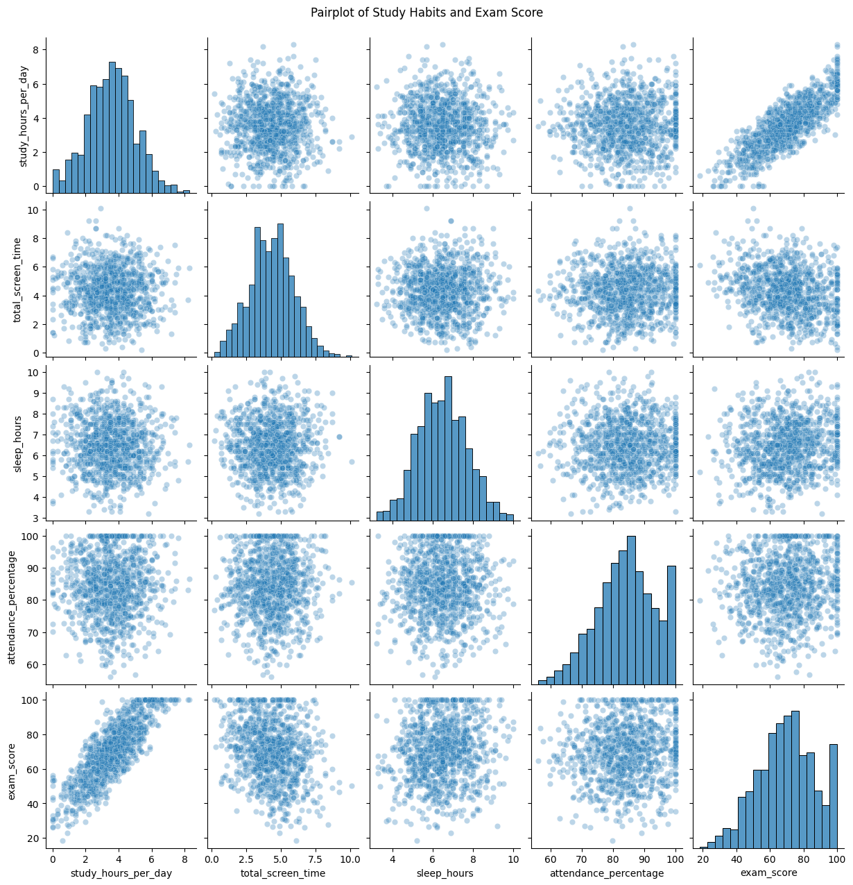
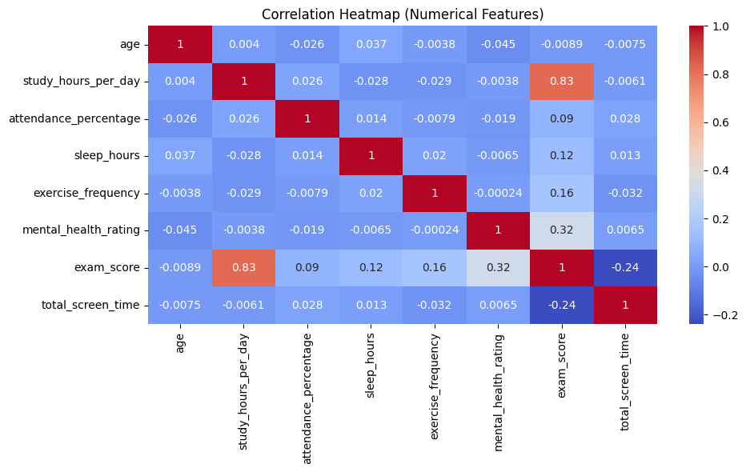

# Capstone Project: Lifestyle and Learning
<b>Submitted By:</b> John Louis D. Lagramada, Reigne Kenneth R. Reyes, Nacer L. Lerit <br>
<b>Data Storytelling:</b> TODO: add video link <br>

## Project Summary
This section discusses the summary of the entire project from preparation of data to deriving actionable insights for improving student performance. In data storytelling, we framed the narrative of the data in a fictional school called Bagong Silang Intergalactic High School.

### Research Problem
This project aims to answer this following research problem using machine learning:

> How do lifestyle habits—such as study time, diet quality, and exercise frequency—influence examination performance of students?

We used unsupervised learning (K-Means) clustering and supervised learning (regression and classification algorithms) to answer this. 

### Approach

We first explored the data with exploratory data analysis through data visualizations. We determined the prevalence of outliers, handled missing data, preprocessed the data, and prepared it for machine learning using data transformation techniques such as standardization in a pipeline. We also engineered new features that is used by the model.

We then used the data provided in several machine learning algorithms. Initially, the data is clustered using <b>K-means</b> where we determined the appropriate number of clusters using both <b>Elbow Method</b> and <b>Silhouette Score</b>. 

In training the supervised learning models, we used an <b>90-10</b> dataset split ratio. Moreover, we used <b>K-fold cross validation</b> for hyperparameter tuning and a <b>hold-out test set</b> that is purely isolated from training. The regression models we used are:
- linear regression
- decision tree regressor
- random forest regressor.

These models are evaluated with:
- R2 score
- mean absolute error
- root mean square error

For classification models, we used:
- logistic regression
- support vector classifier
- random forest classifier

These models are evaluated with:
- area under the receiver operating characteristic curve (AUC ROC)
- confusion matrix metrics
    - accuracy
    - precision
    - recall
    - F1 score

### Results

#### Regression Best Models

| **MODEL**            | **R²**    | **MAE**    | **RMSE**   |
|----------------------|-----------|------------|------------|
| Linear Regression     | 0.882188  | 4.103586   | 5.181170   |
| Random Forest         | 0.829726  | 4.941165   | 6.228832   |
| Decision Tree         | 0.666823  | 6.847842   | 8.713044   |

#### Classification Best Models

| **MODEL**                   | **AUC**    | **ACCURACY** | **PRECISION** | **RECALL**   |
|----------------------------|------------|--------------|---------------|--------------|
| Support Vector Classifier  | 0.938776   | 0.87         | 0.875000      | 0.857143     |
| Logistic Regression         | 0.935174   | 0.85         | 0.854167      | 0.836735     |
| Random Forest Classifier    | 0.925570   | 0.83         | 0.833333      | 0.816327     |


### Conclusion

The study highlights that academic performance is strongly influenced by increased study hours, mental health, and balanced lifestyle habits such as regular exercise and sufficient sleep. Among the predictive models, Linear Regression achieved the highest accuracy for regression tasks, with the best R² and lowest error rates. For classification tasks, the Support Vector Classifier outperformed other models in accuracy, AUC, and overall predictive power. These findings emphasize the effectiveness of combining behavioral and wellness data with appropriate machine learning models to accurately analyze and predict student performance.

## Machine Learning Methods
This section discusses the technical approach used to solve the underlying research problem from exploratory data analysis to model evaluation and benchmarking. We show specific values used in training the model and decisions that we made along the way in squeezing out performance out of the models.

### Data Understanding and Preprocessing
The dataset includes 14 input features and 1 target label (exam_score), along with a unique identifier (student_id). Upon inspection:
- The student_id was removed, as it carries no predictive value.
- Features consisted of both numerical and categorical data types.
- The target variable exam_score was retained only for supervised learning tasks.

**Missing Values**
- No missing values were found in numerical features. 
- For categorical features, entries like "None" in parental_education_level were retained as valid values, representing no formal education. These were not treated as missing to preserve inclusivity and avoid misrepresenting the data.

**Encoding**
- Nominal features were encoded using OneHotEncoder due to their low cardinality and lack of order.
- Ordinal features (diet_quality, parental_education_level) were encoded using OrdinalEncoder to maintain ranking logic in the data.

**Scaling**
- Applied StandardScaler to all numerical features.
- This was appropriate as the features exhibited normalized distributions, making them suitable for models sensitive to scale, such as K-Means and Linear Regression.

**New Features Engineered**
A new feature called total_screen_time was engineered by combining:

- Social media usage time
- Netflix usage time

After creating this new feature, the original two columns were removed to reduce redundancy.


### Exploratory Data Analysis

To better understand the dataset, we performed a series of visual and statistical analyses:

Boxplots were used to inspect the distribution of each feature. The majority of the features were closely distributed with minimal outliers, indicating a relatively clean dataset.


We generated a pairplot to visually explore relationships between features. From this, we observed that study hours was the only feature that showed a clear positive correlation with exam scores, while other feature combinations did not exhibit strong linear relationships.



To confirm these insights, we plotted a correlation heatmap, which provided numerical values for pairwise feature correlations. This reinforced our observation that study hours had the strongest correlation with the target variable. Additionally, we used the heatmap to check for multicollinearity, but found no highly collinear features that required removal.



These steps ensured a thorough understanding of the dataset before proceeding to modeling.

### Clustering

To explore potential natural groupings in the dataset, we applied K-Means Clustering using both the Elbow Method and the Silhouette Score to determine the optimal number of clusters.

Elbow Method:
 The plot of inertia versus the number of clusters did not show a clear "elbow," suggesting that the data may not contain distinct cluster groupings.


Silhouette Score:
 The highest silhouette score occurred at k = 2, but the overall score was still quite low. This further indicated that the dataset does not exhibit a strong inherent clustering structure.


While clustering helped visualize student groupings, there was no strong cluster pattern in the dataset, suggesting that student behaviors and performances exist along a more continuous spectrum rather than in discrete groups.

### Regression

We evaluated the performance of three regression models: Linear Regression, Random Forest Regressor, and Decision Tree Regressor. To ensure robustness and reduce variance in the evaluation, we applied 5-fold cross-validation (k=5). Each model was assessed using the following metrics:


We used the model configurations below:

```
model_configs = {
    'Linear Regression': {
        'model': LinearRegression(),
        'params': {}
    },
    'Decision Tree': {
        'model': DecisionTreeRegressor(random_state=42),
        'params': {
            'max_depth': [3, 5, 10, None],
            'min_samples_split': [2, 5, 10]
        }
    },
    'Random Forest': {
        'model': RandomForestRegressor(random_state=42),
        'params': {
            'n_estimators': [50, 100, 200],
            'max_depth': [5, 10, None],
            'min_samples_split': [2, 5]
        }
    }
}
```

Linear Regression outperformed the other models in terms of both R² and error metrics, indicating its suitability for this particular regression task.

### Classification

For the classification task, we employed three models: Logistic Regression, Support Vector Classifier (SVC), and Random Forest Classifier. Consistent with the regression setup, we used 5-fold cross-validation (k=5) to ensure reliable performance estimates across all models.

We used these configurations:

```
classifier_configs = {
    'Logistic Regression': {
        'model': LogisticRegression(solver='liblinear', random_state=42),
        'params': {
            'C': [0.01, 0.1, 1, 10]
        }
    },
    'Support Vector Classifier': {
        'model': SVC(probability=True, random_state=42),
        'params': {
            'C': [0.1, 1, 10],
            'kernel': ['linear', 'rbf']
        }
    },
    'Random Forest Classifier': {
        'model': RandomForestClassifier(random_state=42),
        'params': {
            'n_estimators': [50, 100, 200],
            'max_depth': [5, 10, None],
            'min_samples_split': [2, 5]
        }
    }
}
```


The Support Vector Classifier achieved the highest overall performance across all metrics, closely followed by Logistic Regression. This suggests both models are well-suited for the classification task, with Random Forests providing a competitive baseline.

## Key Findings
This section discusses feature importance, cluster profiling, and actionable insights derived from the models used in the project.
### Feature Importance

The top 3–5 features that consistently influenced performance across both model types are:


1. Study Hours Per Day – Primary driver of performance.
2. Mental Health Rating – Indicates a strong link between mental well-being and success.
3. Exercise Frequency – Physical activity is a supportive factor.
4. Sleep Hours – Adequate sleep contributes positively.
5. Attendance Percentage – Less impactful than the others, but still relevant.


These results suggest that both academic behaviors and lifestyle factors play a critical role in predicting student success.


### Cluster Profiling

Clustering analysis was performed to explore whether natural groupings existed among students based on academic and behavioral features. Both the Elbow Method and Silhouette Score were used to assess the suitability of clustering.
As shown in the Elbow Method plot, inertia decreases gradually without a distinct "elbow" point, suggesting no optimal number of clusters. This is often a sign that the data does not naturally group into separate clusters.


Silhouette Scores were also evaluated across different values of k. While the highest score occurred at k = 2, all silhouette values were consistently low, indicating weak cluster separation and poor cohesion within potential groups.


These findings imply that the data likely lacks a strong underlying cluster structure. Therefore, clustering was not pursued further, and no distinct student segments were identified from this approach.

### Best Models

Linear Regression emerged as the best-performing model for regression tasks, achieving the highest R² score (0.882) and the lowest MAE and RMSE values. This indicates its strong ability to predict academic scores accurately and consistently based on input features

For classification tasks, the Support Vector Classifier (SVC) outperformed other models with the highest accuracy (0.87), AUC (0.9388), and strong precision and recall scores. Its performance makes it ideal for categorizing students based on performance levels.

### Actionable Insights

- Encourage Consistent Study Habits: Since study_hours_per_day is the top predictor across all models, institutions should promote effective study routines through workshops, academic coaching, or dedicated quiet hours for focused learning.
- Implement Mental Health Support Systems: With mental_health_rating ranking second highest in feature importance, providing access to counseling, stress management programs, and mental wellness initiatives can directly support academic improvement.
- Promote Physical Activity and Balanced Routines: Features like exercise_frequency and sleep_hours highlight the importance of a balanced lifestyle. Schools can promote physical activity through sports programs and wellness campaigns, while students should be encouraged to plan and maintain consistent sleep routines.
- Use the Best-Fit Models for Practical Applications: For score prediction, use Linear Regression due to its superior performance (R² = 0.88). For classification tasks, implement the Support Vector Classifier, which showed the highest accuracy and precision.

## Reproducibility
Developing the project requires certain versions of libraries. To ensure reproducibility, make sure to install all the modules as listed in the `requirements.txt`. The kernel of your Jupyter Notebook should use the virtual environment where the requirements are installed (this is implicit if the steps below are followed). For deterministic numerical outputs, a global variable seed is used which is 121.

1. Clone the repository.
    <pre><code>git clone https://github.com/lukasdante/capstone_teece2.git</code></pre>
2. Create a virtual environment.
    <pre><code>python -m venv env</code></pre>
3. Source your virtual environment.
    - In Linux/macOS
    <pre><code>source env/bin/activate</code></pre>
    - In Windows command prompt
    <pre><code>myenv\Scripts\activate.bat</code></pre>
    - In Windows PowerShell
    <pre><code>.\myenv\Scripts\activate.bat</code></pre>
    If policy error shows up, run the code below:
    <pre><code>Set-ExecutionPolicy -ExecutionPolicy RemoteSigned -Scope CurrentUser</pre></code>
4. Install libraries.
    <pre><code>pip install -r requirements.txt</code></pre>
5. Open Jupyter notebook.
    <pre><code>jupyter notebook</code></pre>
6. Navigate the `source/` directory to view the code. The directory tree is as follows:
    <pre><code>├── data
├── env
├── LICENSE
├── media
├── notebooks
├── outputs
├── README.md
├── requirements.txt
└── src
</code></pre>

## License
This project is licensed under the [MIT License](./LICENSE). Feel free to use, modify, and distribute this project with proper attribution.